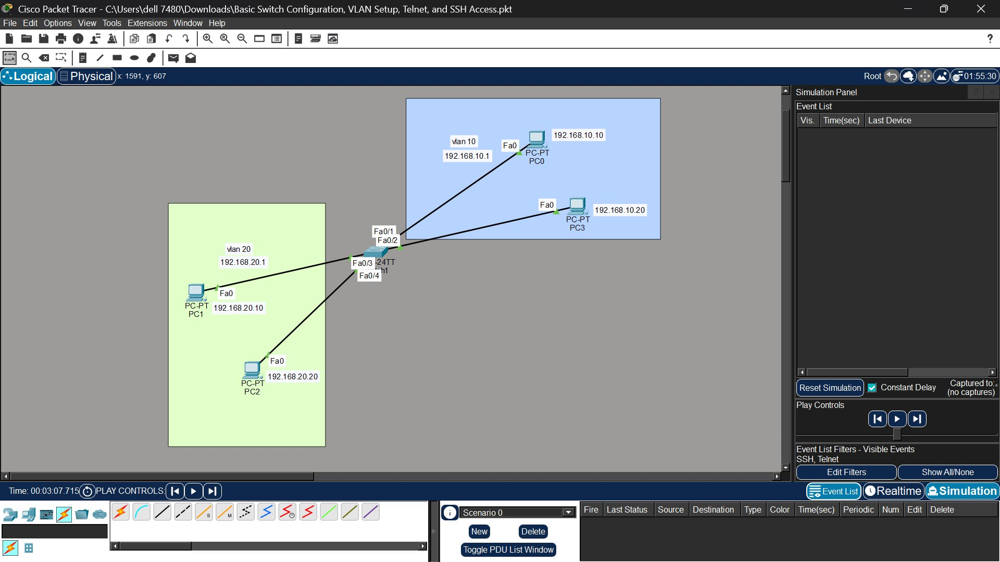

# Lab 01 — Basic Switch Configuration, VLAN Setup, Telnet & SSH Access

**Platform:** Cisco Packet Tracer  
**Difficulty:** Beginner — Intermediate  
**Topics:** Hostname · Passwords · VLANs · SVIs · Telnet · SSH · Port Security  

---

## Objective

Configure a Cisco switch from scratch by setting the hostname, securing access with
passwords, creating VLANs, assigning ports to VLANs, configuring management IP addresses
via SVIs, and enabling remote management using SSH (with Telnet tested first as a baseline).

---

## Topology



| Device | Interface | IP Address       | VLAN      | Role            |
|--------|-----------|------------------|-----------|-----------------|
| SW1    | VLAN 10   | 192.168.10.1/24  | SALES     | SVI / Gateway   |
| SW1    | VLAN 20   | 192.168.20.1/24  | HR        | SVI / Gateway   |
| PC0    | Fa0/1     | 192.168.10.10/24 | VLAN 10   | End Device      |
| PC3    | Fa0/2     | 192.168.10.20/24 | VLAN 10   | End Device      |
| PC1    | Fa0/3     | 192.168.20.10/24 | VLAN 20   | End Device      |
| PC2    | Fa0/4     | 192.168.20.20/24 | VLAN 20   | End Device      |

---

## Key Concepts Covered

- `enable secret` vs `enable password` — why secret is always preferred (MD5 hashing)
- `service password-encryption` — Type 7 encryption on plain-text passwords in config
- SVI (Switched Virtual Interface) — logical Layer 3 IP address assigned to a VLAN
- `switchport mode access` — why it is set explicitly instead of leaving DTP to negotiate
- Why cross-VLAN pings fail without a Layer 3 routing device
- Telnet vs SSH — protocol difference, security implications, and why SSH replaces Telnet
- `login` vs `login local` — shared line password vs local user database authentication
- RSA key generation and why `ip ssh version 2` must be set explicitly

---

## Packet Tracer File

[Download: Basic_Switch_VLAN_SSH.pkt](Basic_Switch_VLAN_SSH.pkt)

Open this file in Cisco Packet Tracer to follow along or test the configuration yourself.

---

## Configuration Steps

---

### STEP 1 — Change Hostname

```
enable
configure terminal
hostname SW1
```

> **Why:** `enable` moves from User EXEC mode `>` to Privileged EXEC mode `#`, required
> before any configuration. `configure terminal` enters Global Configuration mode.
> `hostname SW1` sets the device name, which appears in the CLI prompt and helps identify
> devices in a multi-switch network.

---

### STEP 2 — Configure Enable Secret Password

```
enable secret cisco
```

> **Why:** `enable secret` sets the password to enter Privileged EXEC mode and stores it
> as an MD5 hash — it is never visible in plain text in the config. **Never use
> `enable password`** — it stores the password in plain text. If both are configured,
> `enable secret` always takes priority and `enable password` is ignored.

**Verification:**
```
disable
enable
Password: cisco
```

---

### STEP 3 — Enable Password Encryption

```
service password-encryption
```

> **Why:** Applies Cisco Type 7 encryption to all plain-text passwords in the running
> config (console password, VTY password). It does NOT affect `enable secret` which is
> already MD5-hashed. Type 7 is weak and reversible but prevents casual reading of the
> config. Always enable this as a baseline hardening step.

---

### STEP 4 — Configure Console Password

```
line console 0
 password console
 login
exit
```

> **Why:** `line console 0` accesses the physical console port — there is only one, so
> it is always line 0. `password console` sets the password. `login` is critical — without
> it, the password is configured but never prompted. Without `login`, anyone can plug in
> a console cable and get access with no credentials.

**Verification:**
```
show running-config
```
Look for:
```
line console 0
 password 7 XXXXXXXX    ← encrypted because of Step 3
 login
```

---

### STEP 5 — Create VLAN 10

```
vlan 10
 name SALES
exit
```

> **Why:** `vlan 10` creates the VLAN in the switch's VLAN database. `name SALES`
> assigns a human-readable label — not mandatory but strongly recommended. Named VLANs
> are far easier to manage in `show vlan brief` output, especially in larger networks.

---

### STEP 6 — Assign Ports to VLAN 10

```
interface fa0/1
 switchport mode access
 switchport access vlan 10
exit

interface fa0/2
 switchport mode access
 switchport access vlan 10
exit
```

> **Why:** `switchport mode access` sets the port to carry traffic for exactly one VLAN.
> It also prevents the port from auto-negotiating trunk mode via DTP (Dynamic Trunking
> Protocol), which would be a security risk on end-device ports. `switchport access vlan 10`
> assigns the port to VLAN 10 so any device connected here joins the SALES VLAN.

---

### STEP 7 — Create VLAN 20

```
vlan 20
 name HR
exit
```

> **Why:** Same process as VLAN 10. VLAN 20 is created and named HR to logically separate
> HR department traffic from Sales at Layer 2. Devices in different VLANs cannot communicate
> without a Layer 3 device, providing both security and broadcast isolation.

---

### STEP 8 — Assign Ports to VLAN 20

```
interface range fa0/3-4
 switchport mode access
 switchport access vlan 20
exit
```

> **Why:** `interface range fa0/3-4` configures multiple interfaces simultaneously in a
> single command block. This saves time and eliminates the risk of applying different
> settings to each port individually.

---

### STEP 9 — Verify VLAN Configuration

```
show vlan brief
```

Expected output:
```
VLAN  Name     Status    Ports
----  -------  --------  --------------------
1     default  active    (all other ports)
10    SALES    active    Fa0/1, Fa0/2
20    HR       active    Fa0/3, Fa0/4
```

> **Why:** Confirms VLANs exist, are named correctly, and ports are assigned as expected.
> VLAN 1 is the default — all ports start here until reassigned. Always verify this before
> configuring SVIs.

---

### STEP 10 — Configure VLAN SVIs (Switched Virtual Interfaces)

```
interface vlan 10
 ip address 192.168.10.1 255.255.255.0
 no shutdown
exit

interface vlan 20
 ip address 192.168.20.1 255.255.255.0
 no shutdown
exit
```

> **Why:** An SVI is a logical Layer 3 interface tied to a VLAN with no physical port of
> its own. Assigning an IP address here gives the switch a management presence in that
> VLAN — you Telnet or SSH to this IP. `no shutdown` is required because VLAN interfaces
> are administratively down by default. The SVI will only come up if the VLAN exists in
> the database AND at least one physical port in that VLAN is connected and active.

---

### STEP 11 — Verify SVI Status

```
show ip interface brief
```

Expected output:
```
Interface     IP-Address       OK?  Method  Status  Protocol
Vlan10        192.168.10.1     YES  manual  up      up
Vlan20        192.168.20.1     YES  manual  up      up
```

> **Why:** Both Status and Protocol must show `up`. If Status is `down`, check that a
> port in that VLAN is active. If Protocol is `down`, the VLAN may not exist in the
> VLAN database — re-run `show vlan brief` to confirm.

---

### STEP 12 — Configure PC IP Addresses

| PC  | IP Address      | Subnet Mask     | Default Gateway |
|-----|-----------------|-----------------|-----------------|
| PC0 | 192.168.10.10   | 255.255.255.0   | 192.168.10.1    |
| PC3 | 192.168.10.20   | 255.255.255.0   | 192.168.10.1    |
| PC1 | 192.168.20.10   | 255.255.255.0   | 192.168.20.1    |
| PC2 | 192.168.20.20   | 255.255.255.0   | 192.168.20.1    |

> **Why:** Each PC gets an IP in its VLAN subnet. The default gateway is the SVI IP of
> its VLAN — this tells the PC where to send traffic for other networks. Setting the
> correct gateway is good practice even when inter-VLAN routing is not configured.

---

### STEP 13 — Test Connectivity

**Within VLAN 10:**
```
PC0> ping 192.168.10.20
Result: Success
```

**Within VLAN 20:**
```
PC1> ping 192.168.20.20
Result: Success
```

**Across VLANs:**
```
PC0> ping 192.168.20.10
Result: Fail
```

> **Why the cross-VLAN ping fails:** VLANs are separate Layer 2 broadcast domains.
> Traffic from VLAN 10 destined for VLAN 20 needs a Layer 3 device (a router or a Layer 3
> switch with `ip routing` enabled) to forward packets between subnets. Since neither is
> configured here, the traffic is dropped at the switch.

---

### STEP 14 — Configure Telnet (Temporary Test Only)

```
line vty 0 15
 password telnet123
 login
 transport input telnet
exit
```

> **Why:** `line vty 0 15` configures all 16 virtual terminal lines simultaneously. VTY
> lines are virtual connections used for remote access — without configuring them, all
> remote connections are refused by default. `login` enforces the password. `transport
> input telnet` restricts these lines to Telnet only at this stage. **Telnet is used here
> only to verify basic remote access before SSH is configured. In production, Telnet must
> never be used — it sends all data including passwords in plain text.**

---

### STEP 15 — Test Telnet

From PC0:
```
telnet 192.168.10.1
Password: telnet123
```

Successful login shows: `SW1>`

> **Why:** The switch accepts the Telnet connection via its VLAN 10 SVI IP. After
> confirming basic remote access works, Telnet will be fully replaced by SSH in the
> next step.

---

### STEP 16 — Configure SSH (Replaces Telnet)

```
ip domain-name lab.local
```

> **Why:** A domain name is mandatory for SSH. The RSA key pair is named using
> `hostname.domainname` format (e.g., `SW1.lab.local`). Without a domain name, the
> `crypto key generate rsa` command will fail.

```
username admin secret cisco123
```

> **Why:** SSH uses `login local` authentication, which validates against the local user
> database instead of a single shared line password. This creates the user `admin` with
> an MD5-hashed password. Local users allow per-account login tracking and individual
> accountability — you can tell which user logged in, unlike shared passwords.

```
crypto key generate rsa
1024
```

> **Why:** Generates an RSA public/private key pair to encrypt the SSH session. 1024 bits
> is the minimum Packet Tracer accepts for SSH v2. In real-world environments, always use
> 2048 bits or higher for adequate security strength.

```
ip ssh version 2
```

> **Why:** Forces SSH version 2 exclusively. SSH v1 has known cryptographic weaknesses
> and must never be used. Always specify this explicitly — do not rely on the default
> which may allow v1 fallback.

```
line vty 0 15
 login local
 transport input ssh
exit
```

> **Why:** `login local` tells the switch to authenticate against the local user database
> (the `username admin` account created above) instead of a single line password. `transport
> input ssh` restricts VTY lines to SSH only, which completely disables Telnet. This
> overwrites the Telnet config from Step 14. This is the correct, secure final state.

---

### STEP 17 — Verify SSH Configuration

```
show ip ssh
```

Expected output:
```
SSH Enabled - version 2.0
Authentication timeout: 120 secs
Authentication retries: 3
```

> **Why:** Confirms SSH is active and running v2. If it shows disabled, check that the
> RSA key was generated successfully and `ip ssh version 2` was entered in global config.

---

### STEP 18 — Test SSH

From PC0:
```
ssh -l admin 192.168.10.1
Username: admin
Password: cisco123
```

Successful login shows: `SW1>`

> **Why:** `-l admin` specifies the username to authenticate with. The switch checks this
> against the local user database. The entire session — including password exchange — is
> fully encrypted, unlike Telnet.

---

### STEP 19 — Final Verification Summary

| Command                  | Purpose                                         |
|--------------------------|-------------------------------------------------|
| `show running-config`    | View the full current configuration             |
| `show vlan brief`        | Confirm VLAN names and port assignments         |
| `show ip interface brief`| Confirm SVI IP addresses and up/up status       |
| `show ip ssh`            | Confirm SSH version 2 is enabled                |
| `show users`             | View currently active VTY sessions              |

---

## Lessons Learned

- Always use `enable secret` — never `enable password`
- `service password-encryption` should always be enabled as a baseline
- A VLAN SVI stays down until at least one port in that VLAN is active
- Cross-VLAN traffic requires a Layer 3 device — a Layer 2 switch cannot route
- Telnet is insecure and should only be used temporarily in a lab to confirm basic VTY access
- SSH requires a domain name, an RSA key pair, a local user account, and `ip ssh version 2`
- `transport input ssh` on VTY lines disables Telnet completely — this is intentional and correct

---

