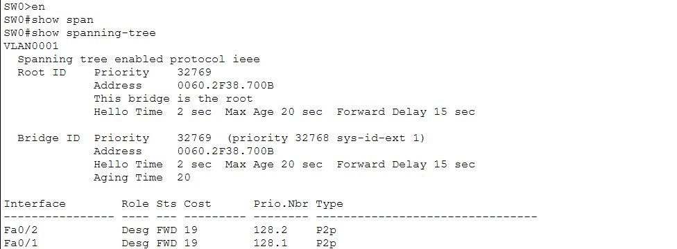
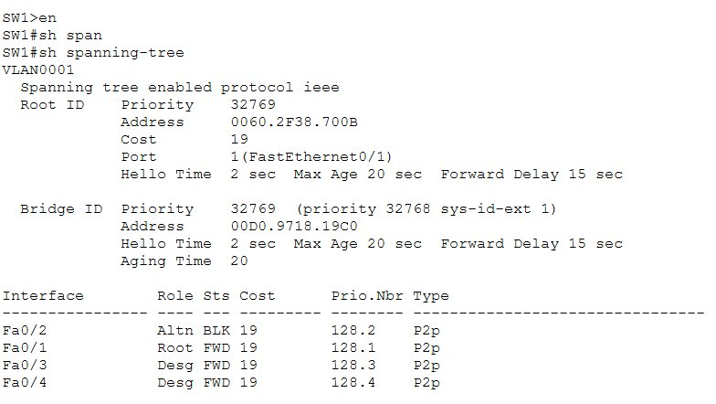
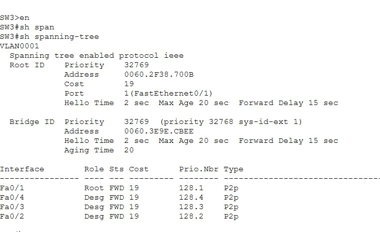
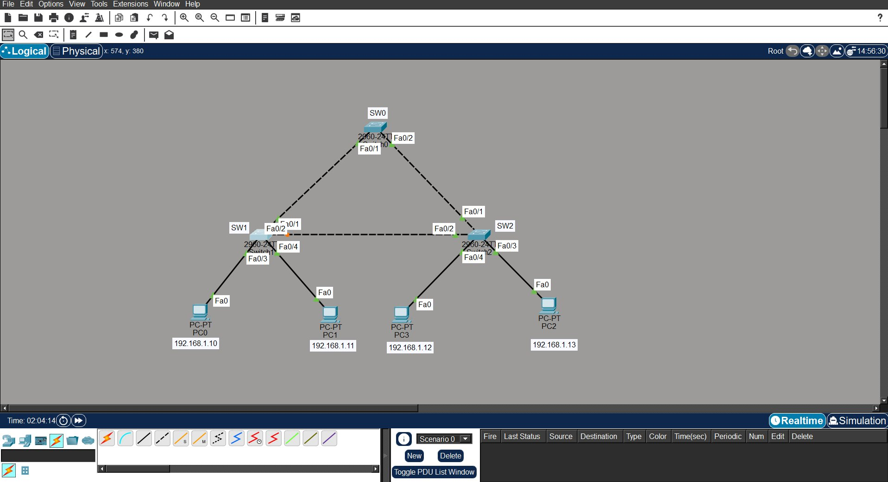
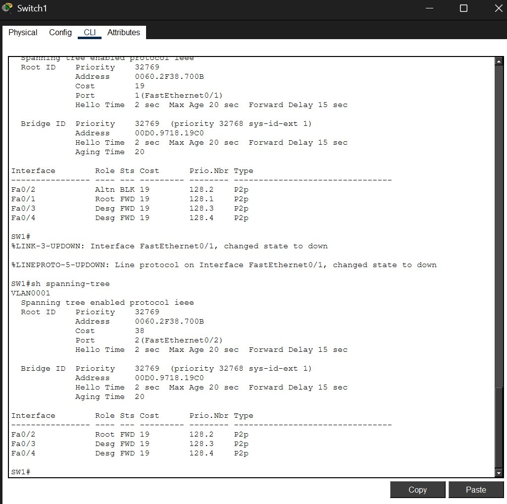
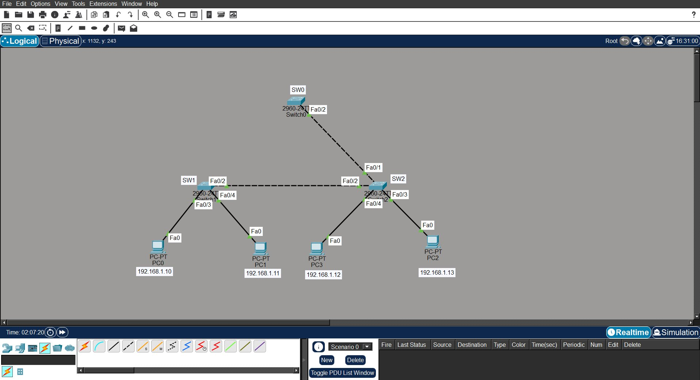
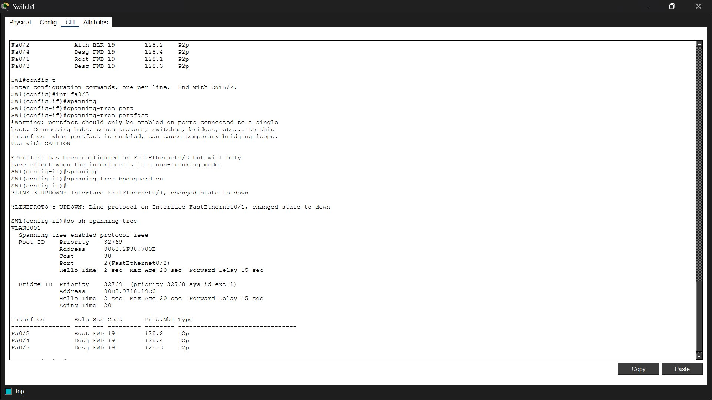

# Lab 02 — Spanning Tree Protocol (STP)

**Platform:** Cisco Packet Tracer
**Difficulty:** Intermediate
**Topics:** STP · Root Bridge Election · Root Port · Designated Port · Blocking Port · Failover · PortFast · BPDU Guard · Loop Prevention

---

## Objective

Build a three-switch triangle topology in Cisco Packet Tracer to observe how STP
automatically prevents Layer 2 loops. Force SW0 as the Root Bridge, identify all
port roles, verify automatic failover when the primary uplink goes down, and configure
PortFast and BPDU Guard on access ports.

---

## Topology

```
                    SW0  (Root Bridge)
                 Fa0/1  Fa0/2
                   /       \
                  /         \
              SW1             SW2
         Fa0/2[BLK] -------- Fa0/2[Desg]

SW1 Fa0/2 is the blocked port — the SW1-SW2 link is the redundant path STP suppresses.

         Fa0/3  Fa0/4    Fa0/3  Fa0/4
           |      |        |      |
          PC0    PC1      PC3    PC2
```

---

## Device Connections

| From | Port | To | Port |
|------|------|----|------|
| SW0 | Fa0/1 | SW1 | Fa0/1 |
| SW0 | Fa0/2 | SW2 | Fa0/1 |
| SW1 | Fa0/2 | SW2 | Fa0/2 |
| SW1 | Fa0/3 | PC0 | Fa0 |
| SW1 | Fa0/4 | PC1 | Fa0 |
| SW2 | Fa0/3 | PC3 | Fa0 |
| SW2 | Fa0/4 | PC2 | Fa0 |

---

## IP Addressing

| Device | IP Address | Subnet Mask |
|--------|-----------|-------------|
| PC0 | 192.168.1.10 | 255.255.255.0 |
| PC1 | 192.168.1.11 | 255.255.255.0 |
| PC2 | 192.168.1.12 | 255.255.255.0 |
| PC3 | 192.168.1.13 | 255.255.255.0 |

All devices belong to VLAN 1.

---

## Key Concepts

**Why STP is needed:** Three switches in a triangle create redundant paths. Without STP,
a broadcast frame loops endlessly — SW1 → SW0 → SW2 → SW1 → SW0... causing:
- Broadcast storms — network saturated with copies of the same frame
- Duplicate frames arriving at the destination
- MAC table instability — switches keep relearning the same MAC on different ports
- Complete network failure within seconds

**What STP does:** Identifies redundant paths and puts one port into Blocking state.
That port listens for BPDUs but forwards no traffic. If the active path fails, STP
transitions the blocked port to Forwarding automatically.

**Root Bridge** — the switch elected as the centre of the STP topology. Election is based
on Bridge Priority (lower wins), ties broken by MAC address (lower wins). Default priority
is 32768 on all switches.

**Root Port** — the port on a non-root switch providing the best path to the Root Bridge.
Exactly one Root Port per non-root switch.

**Designated Port** — the forwarding port on each network segment. The Root Bridge has
all its ports as Designated. On non-root switches, downstream ports are Designated.

**Alternate Port (Altn BLK)** — a blocked port providing a redundant path to the Root
Bridge. Receives BPDUs but forwards no traffic.

---

## Configuration Steps

---

### STEP 1 — Verify Default STP is Running

Cisco switches run STP automatically. Before any configuration, verify it is active:

```
SW0# show spanning-tree
SW1# show spanning-tree
SW2# show spanning-tree
```

> STP runs without enabling it manually. The first `show spanning-tree` output already
> shows an elected Root Bridge and assigned port roles.

---

### STEP 2 — Test Connectivity Before Configuration

```
PC0> ping 192.168.1.12
```

Expected: Success — STP is already preventing loops and the network is functional.

---

### STEP 3 — Force SW0 as Root Bridge

By default the switch with the lowest MAC address wins. To guarantee SW0 is always
the Root Bridge regardless of MAC:

```
SW0# configure terminal
SW0(config)# spanning-tree vlan 1 root primary
SW0(config)# end
```

> `spanning-tree vlan 1 root primary` sets SW0's priority to 24576, making it the
> definitive Root Bridge. Always control which switch is Root in production — never
> leave it to MAC address chance.

---

### STEP 4 — Verify Root Bridge on SW0

```
SW0# show spanning-tree
```



**What the output confirms:**
- Root ID and Bridge ID have the same address — SW0 is the Root Bridge
- "This bridge is the root" line explicitly confirms it
- Both SW0 ports (Fa0/1 and Fa0/2) are Desg FWD — the Root Bridge has no Root Port
  and no Blocking ports

---

### STEP 5 — Verify Root Port and Blocking Port on SW1

```
SW1# show spanning-tree
```



| Interface | Role | State | Meaning |
|-----------|------|-------|---------|
| Fa0/1 | Root | FWD | Best path to Root Bridge via SW0 |
| Fa0/2 | Altn | BLK | Blocked — redundant path to SW2, loop prevention |
| Fa0/3 | Desg | FWD | Forwarding to PC0 |
| Fa0/4 | Desg | FWD | Forwarding to PC1 |

---

### STEP 6 — Verify Root Port on SW2

```
SW2# show spanning-tree
```



| Interface | Role | State | Meaning |
|-----------|------|-------|---------|
| Fa0/1 | Root | FWD | Best path to Root Bridge via SW0 |
| Fa0/2 | Desg | FWD | SW1 Fa0/2 is already blocking — so this side becomes Desg |
| Fa0/3 | Desg | FWD | Forwarding to PC3 |
| Fa0/4 | Desg | FWD | Forwarding to PC2 |

---

### STEP 7 — Normal Traffic Path

```
PC0 → SW1 Fa0/3 → SW1 Fa0/1 → SW0 Fa0/1 → SW0 Fa0/2 → SW2 Fa0/1 → SW2 Fa0/3 → PC2
```

The direct SW1-SW2 link carries no traffic. Traffic takes the longer path through SW0.



---

### STEP 8 — Test Failover

Shut the uplink from SW1 to SW0:

```
SW1(config)# interface fa0/1
SW1(config-if)# shutdown
```

Wait approximately 30 seconds, then:

```
SW1# show spanning-tree
```



**Before disconnect:**
```
Fa0/2   Altn BLK   — blocked, redundant path
Fa0/1   Root FWD   — active uplink to SW0
```

**Console messages on link failure:**
```
%LINK-3-UPDOWN: Interface FastEthernet0/1, changed state to down
%LINEPROTO-5-UPDOWN: Line protocol on Interface FastEthernet0/1, changed state to down
```

**After STP reconverges:**
```
Fa0/2   Root FWD   — previously blocked, now the Root Port
Fa0/3   Desg FWD
Fa0/4   Desg FWD
```

**Key observations:**
- Fa0/1 disappears from the port list — the link is down
- Fa0/2 changes from Altn BLK → Root FWD — STP activated the backup path
- Cost changes from 19 to 38 — previously one hop (SW1→SW0), now two hops
  (SW1→SW2→SW0), so cost doubles
- Root port changes from port 1 to port 2



---

### STEP 9 — Verify Connectivity After Failover

```
PC0> ping 192.168.1.12
```

Expected: Success — communication continues because STP activated the backup path.

New traffic path after failover:
```
PC0 → SW1 Fa0/3 → SW1 Fa0/2 → SW2 Fa0/2 → SW2 Fa0/3 → PC2
```

---

### STEP 10 — Configure PortFast and BPDU Guard on Access Ports

Access ports connected to end devices (PCs) should skip the 30-second
listening/learning delay and go directly to Forwarding:

```
SW1(config)# interface fa0/3
SW1(config-if)# spanning-tree portfast
SW1(config-if)# spanning-tree bpduguard enable
SW1(config-if)# exit

SW1(config)# interface fa0/4
SW1(config-if)# spanning-tree portfast
SW1(config-if)# spanning-tree bpduguard enable
SW1(config-if)# exit
```

Apply the same on SW2 access ports (Fa0/3 and Fa0/4).



The screenshot confirms:
- PortFast configured on Fa0/3 with the expected IOS warning about connecting
  only single hosts (not switches or hubs)
- BPDU Guard enabled on Fa0/3
- Failover already triggered — SW1 shows cost 38 and Fa0/2 as Root FWD, confirming
  the blocked port successfully transitioned after the SW0 uplink was shut

**Why PortFast:** Eliminates the 30-second delay (15s listening + 15s learning) for
ports that will never receive BPDUs. PCs can connect immediately instead of waiting
half a minute for STP to converge.

**Why BPDU Guard:** If a switch is accidentally connected to a PortFast port, it will
send BPDUs. BPDU Guard immediately puts the port into err-disabled state, protecting
the STP topology. This is the safety mechanism that makes PortFast safe to use on
access ports.

**Recovering an err-disabled port:**
```
SW1(config)# interface fa0/3
SW1(config-if)# shutdown
SW1(config-if)# no shutdown
```

---

## Verification Summary

| Check | Command | Expected Result |
|-------|---------|----------------|
| Root Bridge | `show spanning-tree` on SW0 | "This bridge is the root" |
| SW1 Root Port | `show spanning-tree` on SW1 | Fa0/1 Root FWD |
| Blocking port | `show spanning-tree` on SW1 | Fa0/2 Altn BLK |
| SW2 Root Port | `show spanning-tree` on SW2 | Fa0/1 Root FWD |
| Failover trigger | Shutdown SW1 Fa0/1 | `%LINK-3-UPDOWN` message |
| After failover | `show spanning-tree` on SW1 | Fa0/2 Root FWD, cost 38 |
| PortFast | `show spanning-tree interface fa0/3 detail` | "The port is in the portfast mode" |
| BPDU Guard | `show spanning-tree summary` | BPDU Guard enabled |
| Connectivity | `ping 192.168.1.12` from PC0 | Success before and after failover |

---

## STP Port Role Summary

| Switch | Port | Role | State | Why |
|--------|------|------|-------|-----|
| SW0 | Fa0/1 | Designated | FWD | Root Bridge — all ports Designated |
| SW0 | Fa0/2 | Designated | FWD | Root Bridge — all ports Designated |
| SW1 | Fa0/1 | Root | FWD | Best path to Root Bridge (cost 19) |
| SW1 | Fa0/2 | Alternate | BLK | Redundant path — loop prevention |
| SW1 | Fa0/3 | Designated | FWD | Downstream to PC0 — PortFast enabled |
| SW1 | Fa0/4 | Designated | FWD | Downstream to PC1 — PortFast enabled |
| SW2 | Fa0/1 | Root | FWD | Best path to Root Bridge (cost 19) |
| SW2 | Fa0/2 | Designated | FWD | SW1 side is already blocking |
| SW2 | Fa0/3 | Designated | FWD | Downstream to PC3 — PortFast enabled |
| SW2 | Fa0/4 | Designated | FWD | Downstream to PC2 — PortFast enabled |

---

## Lessons Learned

- STP runs automatically on Cisco switches — it does not need to be enabled manually
- Always manually set the Root Bridge using `spanning-tree vlan 1 root primary` — never rely on MAC address election in production
- The Root Bridge has no Root Port and no Blocking ports — all its ports are Designated Forwarding
- There is exactly one Root Port per non-root switch — the port with the lowest cost path to Root
- STP failover takes approximately 30 seconds in classic 802.1D
- After failover, cost doubles when the path now goes through an extra hop
- Always configure PortFast on access ports — the 30-second delay is unnecessary for PC connections
- BPDU Guard is the safety net for PortFast — it err-disables the port instantly if a switch is accidentally connected
- Never enable PortFast on trunk ports or uplinks — only on access ports connected to end devices
