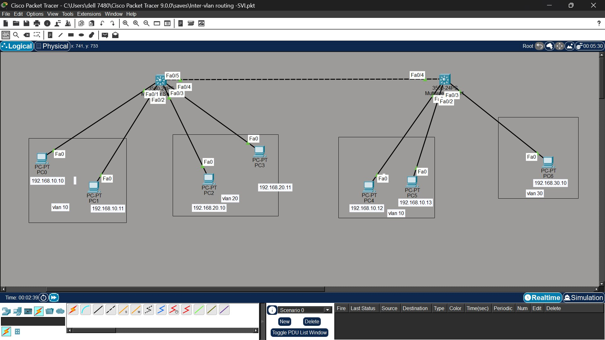
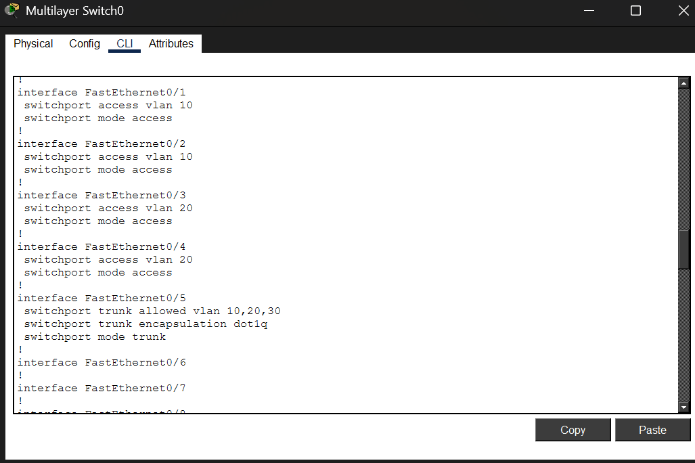
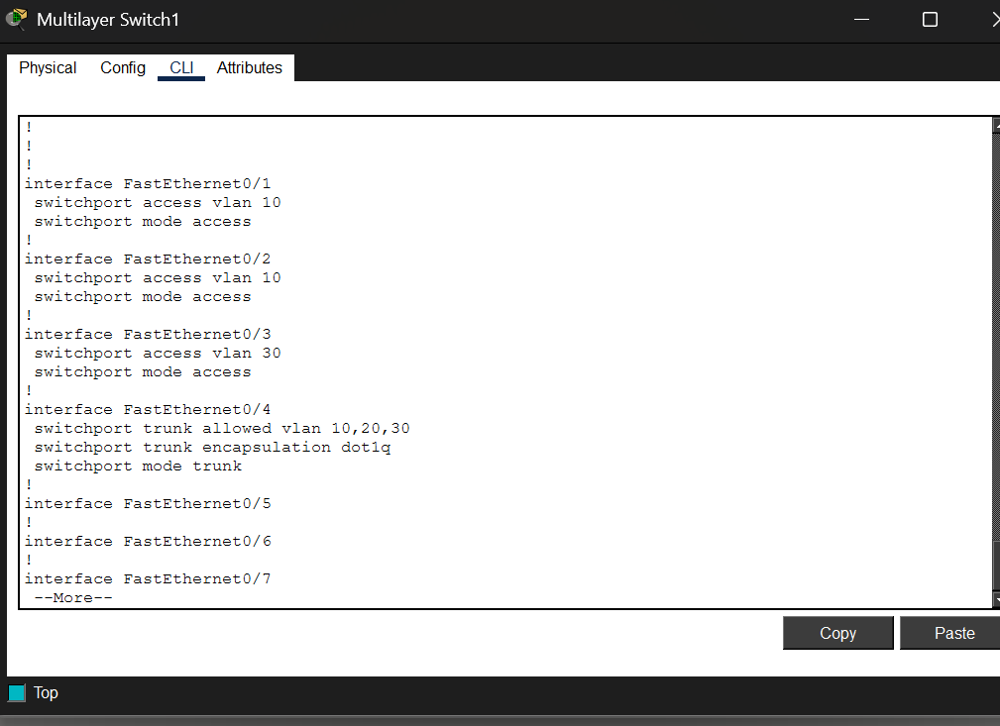
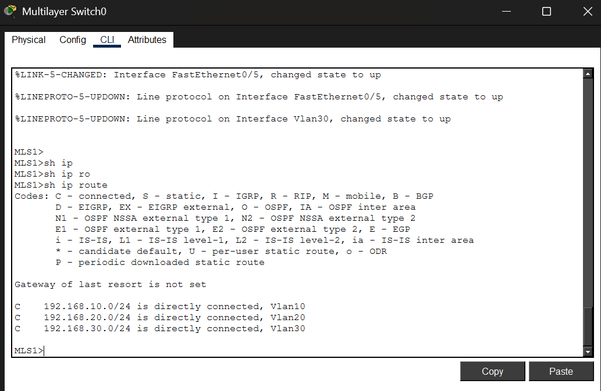
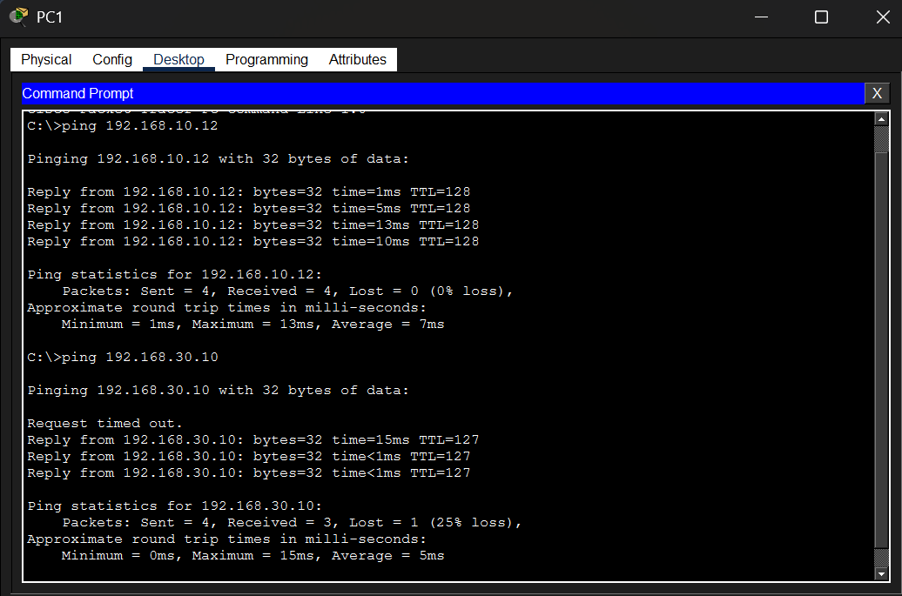
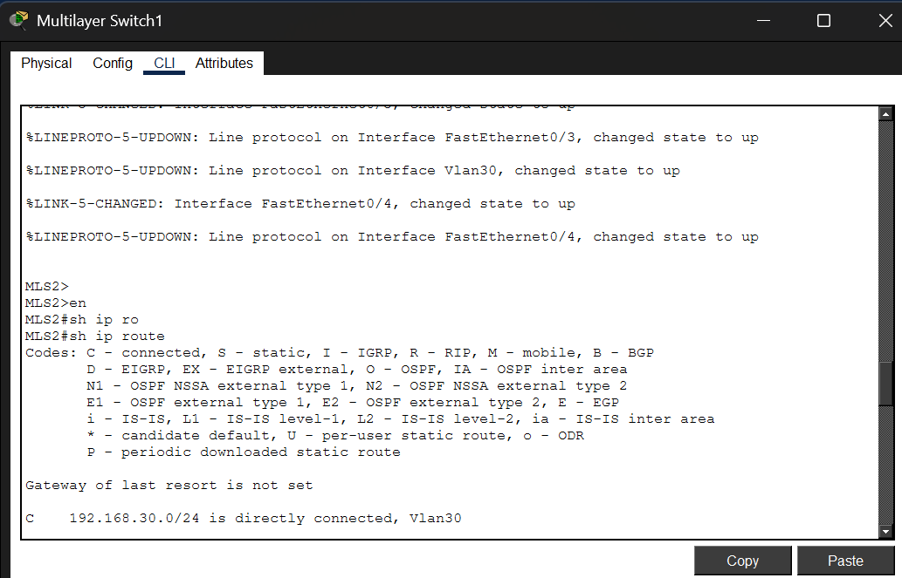

# Lab 03 — Inter-VLAN Routing Using SVI (Layer-3 Switch)

**Platform:** Cisco Packet Tracer
**Difficulty:** Intermediate
**Topics:** Inter-VLAN Routing · SVI · Trunking · ip routing · Layer-3 Switch · Troubleshooting

---

## Objective

Configure inter-VLAN routing across two Layer-3 switches using Switched Virtual
Interfaces (SVIs). Demonstrate that VLANs on different switches can communicate
through a trunk link, and troubleshoot a scenario where a missing VLAN entry
breaks connectivity.

---

## Topology



> Two Cisco 3560-24PS multilayer switches connected via trunk (MLS1 Fa0/5 ↔ MLS2 Fa0/4).
> VLAN 10 spans both switches. VLAN 20 is local to MLS1. VLAN 30 is local to MLS2.
> MLS1 holds SVIs for all three VLANs and handles all inter-VLAN routing.

```
        MLS1 ========================= MLS2
         |   Fa0/5 -- Fa0/4 Trunk       |
         |   VLANs 10,20,30             |
      Fa0/1 Fa0/2 Fa0/3 Fa0/4     Fa0/1 Fa0/2 Fa0/3
        |     |     |     |           |     |     |
       PC0   PC1   PC2   PC3         PC4   PC5   PC6

      V10   V10   V20   V20         V10   V10   V30
```

---

## Device Connections

| Switch | Port  | Connected To | VLAN  |
|--------|-------|--------------|-------|
| MLS1   | Fa0/1 | PC0          | 10    |
| MLS1   | Fa0/2 | PC1          | 10    |
| MLS1   | Fa0/3 | PC2          | 20    |
| MLS1   | Fa0/4 | PC3          | 20    |
| MLS1   | Fa0/5 | MLS2 Fa0/4   | Trunk |
| MLS2   | Fa0/1 | PC4          | 10    |
| MLS2   | Fa0/2 | PC5          | 10    |
| MLS2   | Fa0/3 | PC6          | 30    |

---

## IP Addressing

| Device          | IP Address     | Subnet Mask     | Gateway       | VLAN |
|-----------------|----------------|-----------------|---------------|------|
| PC0             | 192.168.10.10  | 255.255.255.0   | 192.168.10.1  | 10   |
| PC1             | 192.168.10.11  | 255.255.255.0   | 192.168.10.1  | 10   |
| PC2             | 192.168.20.10  | 255.255.255.0   | 192.168.20.1  | 20   |
| PC3             | 192.168.20.11  | 255.255.255.0   | 192.168.20.1  | 20   |
| PC4             | 192.168.10.12  | 255.255.255.0   | 192.168.10.1  | 10   |
| PC5             | 192.168.10.13  | 255.255.255.0   | 192.168.10.1  | 10   |
| PC6             | 192.168.30.10  | 255.255.255.0   | 192.168.30.1  | 30   |
| MLS1 SVI VLAN10 | 192.168.10.1   | 255.255.255.0   | —             | 10   |
| MLS1 SVI VLAN20 | 192.168.20.1   | 255.255.255.0   | —             | 20   |
| MLS1 SVI VLAN30 | 192.168.30.1   | 255.255.255.0   | —             | 30   |

> **Why MLS1 owns all three SVIs:** MLS1 is the central routing switch. All inter-VLAN
> routing decisions pass through MLS1. Even though PC6 (VLAN 30) is physically on MLS2,
> its gateway is MLS1's VLAN 30 SVI (192.168.30.1). Traffic from PC6 travels across the
> trunk to MLS1 for routing. MLS2 has `ip routing` enabled and VLAN 10 and VLAN 30
> interfaces configured but with no IP addresses — it acts as a Layer 2 forwarding
> switch for those VLANs, relying on MLS1 for routing.

---

## Key Concepts

**Why VLANs cannot communicate by default:** Each VLAN is a separate Layer 2 broadcast
domain. Frames from VLAN 10 cannot cross into VLAN 20 without a Layer 3 routing decision.

**SVI (Switched Virtual Interface):** A logical Layer 3 interface on the switch assigned
to a VLAN. When a VLAN has an SVI with an IP address, that IP becomes the default gateway
for all devices in that VLAN.

**`ip routing`:** This single command enables Layer 3 switching. Without it, even a
multilayer switch only forwards frames at Layer 2. Both MLS1 and MLS2 have `ip routing`
enabled — but only MLS1 has IP addresses on its SVIs, making it the active router.

**Trunk link:** A single link carrying traffic for multiple VLANs simultaneously using
802.1Q tagging. Without the trunk between MLS1 and MLS2, PC4, PC5, and PC6 cannot
reach any other VLAN.

**Why both switches must know every VLAN:** A switch only processes frames for VLANs
that exist in its local VLAN database. Both switches must have VLANs 10, 20, and 30
defined even if they have no access ports in some of those VLANs.

---

## Packet Tracer File

[Download: inter-vlan-routing-svi.pkt](inter-vlan-routing-svi.pkt)

Open this file in Cisco Packet Tracer to follow along or test the configuration.

---

## Configuration Steps

---

### STEP 1 — Create VLANs on MLS1

```
MLS1# configure terminal
MLS1(config)# vlan 10
MLS1(config-vlan)# name SALES
MLS1(config)# vlan 20
MLS1(config-vlan)# name HR
MLS1(config)# vlan 30
MLS1(config-vlan)# name ACCOUNTS
MLS1(config)# exit
```

> **Why create VLAN 30 on MLS1 even though no MLS1 access port belongs to VLAN 30?**
> MLS1 needs VLAN 30 in its database to process VLAN 30 tagged frames arriving
> over the trunk from MLS2, and to bring up the VLAN 30 SVI. Without this entry,
> MLS1 silently drops those frames.

---

### STEP 2 — Assign Access Ports on MLS1

```
MLS1(config)# interface range fa0/1-2
MLS1(config-if-range)# switchport mode access
MLS1(config-if-range)# switchport access vlan 10
MLS1(config-if-range)# exit

MLS1(config)# interface range fa0/3-4
MLS1(config-if-range)# switchport mode access
MLS1(config-if-range)# switchport access vlan 20
MLS1(config-if-range)# exit
```

---

### STEP 3 — Configure Trunk Port on MLS1

```
MLS1(config)# interface fa0/5
MLS1(config-if)# switchport trunk encapsulation dot1q
MLS1(config-if)# switchport trunk allowed vlan 10,20,30
MLS1(config-if)# switchport mode trunk
MLS1(config-if)# exit
```

> On the 3560-24PS you must specify `switchport trunk encapsulation dot1q` before
> setting trunk mode — unlike 2960 switches, the 3560 supports multiple encapsulation
> types and requires explicit selection.



> Confirms Fa0/1-0/2 set to VLAN 10 access, Fa0/3-0/4 set to VLAN 20 access,
> and Fa0/5 configured as a trunk allowing VLANs 10, 20, 30 with dot1q
> encapsulation.

---

### STEP 4 — Create VLANs on MLS2

```
MLS2# configure terminal
MLS2(config)# vlan 10
MLS2(config-vlan)# name SALES
MLS2(config)# vlan 20
MLS2(config-vlan)# name HR
MLS2(config)# vlan 30
MLS2(config-vlan)# name ACCOUNTS
MLS2(config)# exit
```

> All three VLANs must exist on MLS2 even though MLS2 only has access ports in
> VLAN 10 and VLAN 30. VLAN 20 must be in the database for MLS2 to forward
> VLAN 20 tagged frames arriving on the trunk without dropping them.

---

### STEP 5 — Assign Access Ports on MLS2

```
MLS2(config)# interface range fa0/1-2
MLS2(config-if-range)# switchport mode access
MLS2(config-if-range)# switchport access vlan 10
MLS2(config-if-range)# exit

MLS2(config)# interface fa0/3
MLS2(config-if)# switchport mode access
MLS2(config-if)# switchport access vlan 30
MLS2(config-if)# exit
```

---

### STEP 6 — Configure Trunk Port on MLS2

```
MLS2(config)# interface fa0/4
MLS2(config-if)# switchport trunk encapsulation dot1q
MLS2(config-if)# switchport trunk allowed vlan 10,20,30
MLS2(config-if)# switchport mode trunk
MLS2(config-if)# exit
```



> Confirms Fa0/1-0/2 set to VLAN 10 access, Fa0/3 set to VLAN 30 access, and
> Fa0/4 configured as a trunk allowing VLANs 10, 20, 30 — matching MLS1's trunk
> configuration on the other end of the link.

---

### STEP 7 — Enable IP Routing on Both Switches

```
MLS1(config)# ip routing
MLS2(config)# ip routing
```

> Without `ip routing`, the switch operates purely at Layer 2 regardless of SVIs
> configured. This is the most common mistake in SVI labs.

---

### STEP 8 — Create SVIs on MLS1

MLS1 owns the gateway IP for all three VLANs.

```
MLS1(config)# interface vlan 10
MLS1(config-if)# ip address 192.168.10.1 255.255.255.0
MLS1(config-if)# no shutdown
MLS1(config-if)# exit

MLS1(config)# interface vlan 20
MLS1(config-if)# ip address 192.168.20.1 255.255.255.0
MLS1(config-if)# no shutdown
MLS1(config-if)# exit

MLS1(config)# interface vlan 30
MLS1(config-if)# ip address 192.168.30.1 255.255.255.0
MLS1(config-if)# no shutdown
MLS1(config-if)# exit
```

> MLS1 is the routing hub — it has SVIs for all three VLANs so it can route between
> any pair. When PC6 (VLAN 30, on MLS2) needs to reach PC0 (VLAN 10, on MLS1),
> traffic crosses the trunk to MLS1, gets routed at Layer 3, and is forwarded to PC0.

---

### STEP 9 — Verify SVI Status on MLS1

```
show ip interface brief
```

Expected:
```
Interface     IP-Address      OK?  Status   Protocol
Vlan10        192.168.10.1    YES  up       up
Vlan20        192.168.20.1    YES  up       up
Vlan30        192.168.30.1    YES  up       up
```

> All three SVIs must show up/up. If any shows down/down, check that at least one
> active port in that VLAN is connected — SVIs stay down with no active ports.

---

### STEP 10 — Verify VLANs and Trunk

```
show vlan brief
show interfaces trunk
```

Expected trunk output on MLS1:
```
Port    Mode    Encapsulation  Status    VLANs Allowed
Fa0/5   on      802.1q         trunking  1,10,20,30
```

---

### STEP 11 — Verify Routing Table on MLS1

```
show ip route
```

Expected:
```
C   192.168.10.0/24 is directly connected, Vlan10
C   192.168.20.0/24 is directly connected, Vlan20
C   192.168.30.0/24 is directly connected, Vlan30
```



> MLS1's routing table confirms all three VLANs (10, 20, 30) are directly
> connected via their SVIs — this is the routing hub for the entire topology.

---

### STEP 12 — Connectivity Tests

| Test                         | From                      | To  | Expected   |
|------------------------------|---------------------------|-----|------------|
| Same VLAN, same switch       | PC0 `ping 192.168.10.11`  | PC1 | ✅ Success |
| Same VLAN, different switch  | PC0 `ping 192.168.10.12`  | PC4 | ✅ Success |
| Different VLAN, same switch  | PC0 `ping 192.168.20.10`  | PC2 | ✅ Success |
| Cross-switch, different VLAN | PC0 `ping 192.168.30.10`  | PC6 | ✅ Success |
| VLAN 20 to VLAN 30           | PC2 `ping 192.168.30.10`  | PC6 | ✅ Success |



> PC1 pinging 192.168.10.12 (PC4, same VLAN 10, different switch via trunk) —
> success, average 7ms. PC1 pinging 192.168.30.10 (PC6, cross-VLAN, cross-switch,
> routed through MLS1) — first packet times out (normal ARP resolution delay),
> remaining packets succeed with 25% overall loss recorded but the route confirmed
> working.



> MLS2's routing table shows only `192.168.30.0/24` directly connected via
> Vlan30 — confirming MLS2 does not hold SVIs for VLAN 10 or VLAN 20. All
> routing for those VLANs is handled by MLS1 across the trunk, exactly as
> documented in the IP Addressing section above.

---

## Running Configuration Reference

The HTML file `show-running-config-inter-vlan-routing-svi-lab.html` contains the full
`show running-config` output for both MLS1 and MLS2 with syntax highlighting.

Key observations from the running config:

- MLS1 has `ip routing` and IP addresses on all three VLAN SVIs
- MLS2 has `ip routing` but `no ip address` on its VLAN interfaces — it forwards at Layer 2 only
- MLS1 Fa0/5 and MLS2 Fa0/4 both use `switchport trunk encapsulation dot1q` — required on 3560
- VLAN 1 is explicitly shut on both switches — best practice to disable the default VLAN

---

## Troubleshooting Scenario — VLAN 30 Not Reachable

**Symptom:**
```
PC2> ping 192.168.30.10
Destination host unreachable
```

**Diagnosis:**

```
MLS1# show vlan brief
```

VLAN 30 is missing from MLS1's VLAN database — MLS1 drops all VLAN 30 tagged frames
arriving on the trunk from MLS2, and the VLAN 30 SVI cannot come up.

```
MLS1# show interfaces trunk
```

VLAN 30 is absent from the allowed VLANs list, confirming the issue.

**Fix:**

```
MLS1(config)# vlan 30
MLS1(config-vlan)# name ACCOUNTS
MLS1(config-vlan)# exit
```

**Verify:**
```
MLS1# show vlan brief        → VLAN 30 now listed
MLS1# show interfaces trunk  → VLAN 30 now in allowed list
PC2> ping 192.168.30.10      → Success
```

**Interview question this scenario answers:**

> Can a trunk carry traffic for a VLAN that does not exist locally on the switch?

**Answer:** No. The VLAN must exist in the switch's VLAN database or frames tagged
for that VLAN are silently dropped.

---

## How Traffic Flows (PC6 to PC0)

```
PC6 (192.168.30.10, VLAN 30, on MLS2)
  → sends packet to default gateway 192.168.30.1 (MLS1 SVI)
  → MLS2 tags frame VLAN 30, forwards over trunk Fa0/4 to MLS1 Fa0/5
  → MLS1 VLAN 30 SVI receives packet
  → MLS1 routing table: 192.168.10.0/24 → directly connected Vlan10
  → MLS1 forwards to PC0 via Fa0/1
```

---

## Verification Summary

| Command                   | Where  | What to Confirm                         |
|---------------------------|--------|-----------------------------------------|
| `show vlan brief`         | Both   | VLANs 10, 20, 30 all listed             |
| `show interfaces trunk`   | Both   | Trunk active, VLANs 10/20/30 allowed    |
| `show ip interface brief` | MLS1   | All three SVIs up/up with IPs           |
| `show ip route`           | MLS1   | Three connected routes present          |
| `ping 192.168.30.10`      | PC0    | Cross-switch cross-VLAN success         |

---

## Lessons Learned

- `ip routing` is mandatory on a Layer-3 switch — without it SVIs do not route
- Every VLAN must exist in the local VLAN database on every switch that carries its traffic — even without local access ports
- The 3560-24PS requires `switchport trunk encapsulation dot1q` before `switchport mode trunk` — unlike 2960 switches
- MLS2 has `ip routing` enabled but no SVI IPs — it participates in routing infrastructure but delegates all routing decisions to MLS1
- VLAN 1 should always be explicitly shut on SVIs — it is the default management VLAN and leaving it active is a security risk
- Troubleshooting order: VLAN exists → Trunk working → SVI up/up → ip routing enabled → route present → correct gateway on PC
