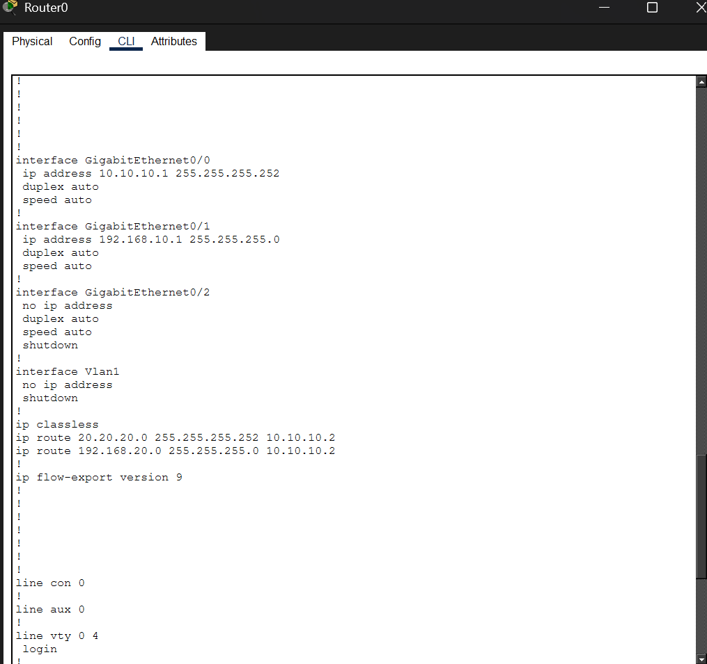
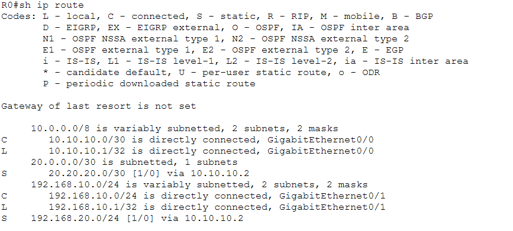
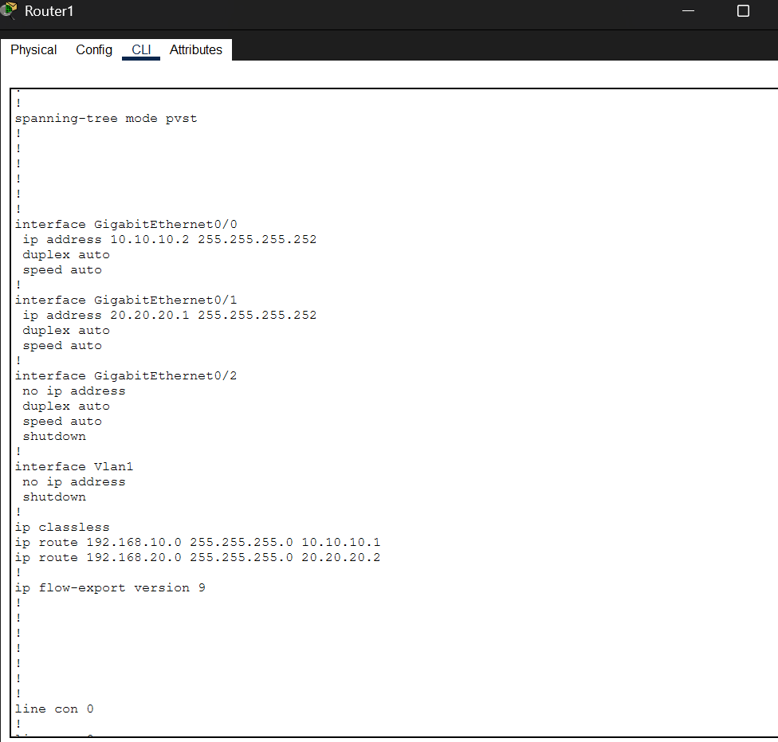
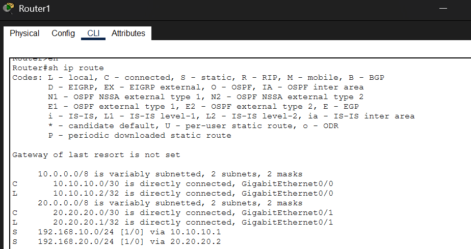
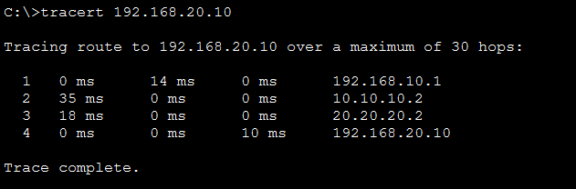
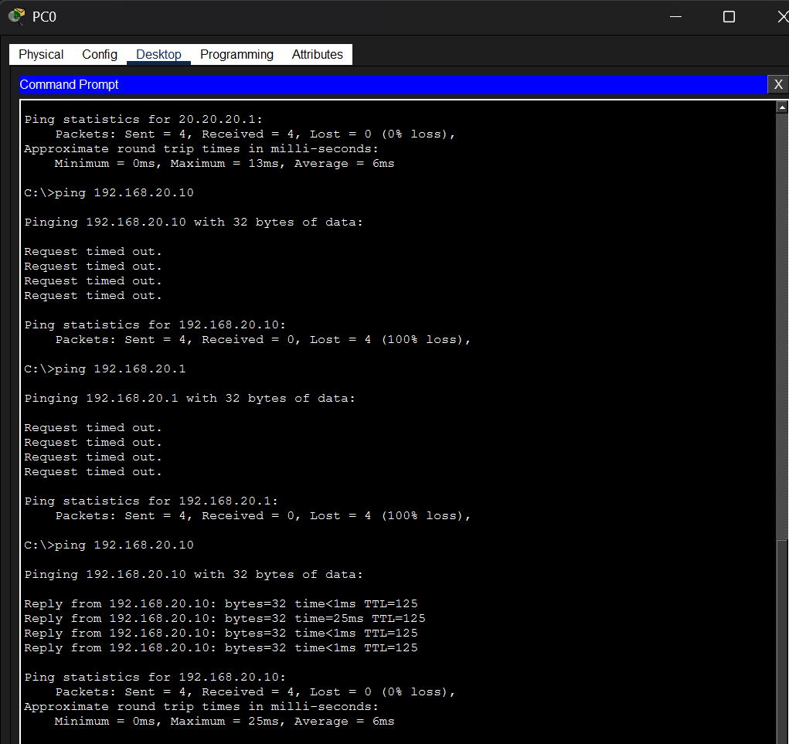
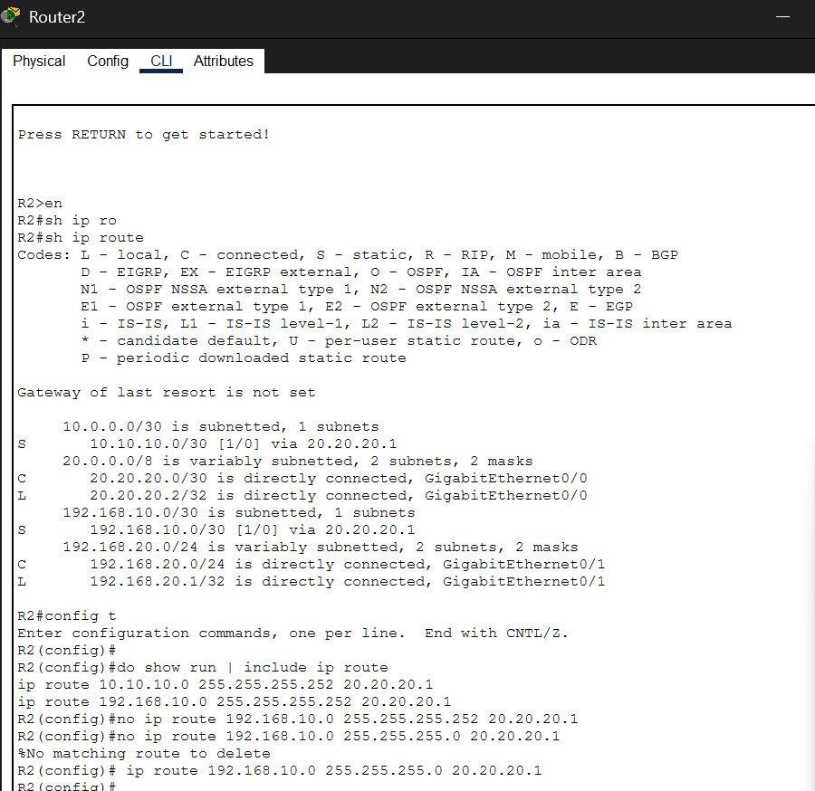

# Lab 05 — Static Routing (Three-Router Topology with Troubleshooting)

**Platform:** Cisco Packet Tracer  
**Difficulty:** Intermediate  
**Topics:** Static Routing · ip route · Next-Hop · Routing Table · Troubleshooting · Wrong Subnet Mask

---

## Objective

Configure static routes across a three-router topology to enable end-to-end communication
between two LANs. Introduce a deliberate misconfiguration (wrong subnet mask on a static
route) and work through a structured troubleshooting process to identify and fix the fault.

---

## Topology

```
PC0                                              PC4
192.168.10.10                              192.168.20.10
     |                                           |
  G0/1                                        G0/1
  R0 (Router0)                           R2 (Router2)
  G0/0                                        G0/0
     |                                           |
 10.10.10.1 ---- R1 (Router1) ---- 20.20.20.2
 10.10.10.0/30      WAN Links      20.20.20.0/30
```

---

## IP Addressing

| Device | Interface | IP Address | Subnet Mask | Purpose |
|--------|-----------|-----------|-------------|---------|
| R0 | G0/0 | 10.10.10.1 | 255.255.255.252 (/30) | WAN link to R1 |
| R0 | G0/1 | 192.168.10.1 | 255.255.255.0 | LAN — PC0 network |
| R1 | G0/0 | 10.10.10.2 | 255.255.255.252 (/30) | WAN link to R0 |
| R1 | G0/1 | 20.20.20.1 | 255.255.255.252 (/30) | WAN link to R2 |
| R2 | G0/0 | 20.20.20.2 | 255.255.255.252 (/30) | WAN link to R1 |
| R2 | G0/1 | 192.168.20.1 | 255.255.255.0 | LAN — PC4 network |
| PC0 | Fa0 | 192.168.10.10 | 255.255.255.0 | Default GW: 192.168.10.1 |
| PC4 | Fa0 | 192.168.20.10 | 255.255.255.0 | Default GW: 192.168.20.1 |

> **Why /30 on WAN links?** A /30 subnet provides exactly 2 usable host addresses —
> perfect for a point-to-point link between two routers. Using /24 on a WAN link
> wastes 252 addresses. /30 is the standard for router-to-router links.

---

## Key Concepts

**Static Route** is a manually configured route that tells the router exactly where
to send packets for a specific destination network. Unlike dynamic routing protocols
(OSPF, EIGRP), static routes do not update automatically when the network changes —
they require manual addition, modification, and removal.

**Syntax:**
```
ip route [destination-network] [subnet-mask] [next-hop-IP]
```

**Next-Hop IP** is the IP address of the next router's interface that this router
should forward packets to. Getting this wrong — or using the wrong subnet mask on
the destination — are the two most common static routing mistakes.

**`show ip route` codes:**
- `C` — Directly Connected (the router has an interface in this network)
- `L` — Local (the router's own interface IP)
- `S` — Static (manually configured route)

---

## Configuration Steps

---

### STEP 1 — Configure R0 Interfaces

```
R0# configure terminal
R0(config)# interface g0/0
R0(config-if)# ip address 10.10.10.1 255.255.255.252
R0(config-if)# no shutdown
R0(config-if)# exit

R0(config)# interface g0/1
R0(config-if)# ip address 192.168.10.1 255.255.255.0
R0(config-if)# no shutdown
R0(config-if)# exit
```

---

### STEP 2 — Configure R1 Interfaces

```
R1# configure terminal
R1(config)# interface g0/0
R1(config-if)# ip address 10.10.10.2 255.255.255.252
R1(config-if)# no shutdown
R1(config-if)# exit

R1(config)# interface g0/1
R1(config-if)# ip address 20.20.20.1 255.255.255.252
R1(config-if)# no shutdown
R1(config-if)# exit
```

---

### STEP 3 — Configure R2 Interfaces

```
R2# configure terminal
R2(config)# interface g0/0
R2(config-if)# ip address 20.20.20.2 255.255.255.252
R2(config-if)# no shutdown
R2(config-if)# exit

R2(config)# interface g0/1
R2(config-if)# ip address 192.168.20.1 255.255.255.0
R2(config-if)# no shutdown
R2(config-if)# exit
```

---

### STEP 4 — Add Static Routes on R0

```
R0(config)# ip route 20.20.20.0 255.255.255.252 10.10.10.2
R0(config)# ip route 192.168.20.0 255.255.255.0 10.10.10.2
```

> R0 does not know about the 20.20.20.0/30 and 192.168.20.0/24 networks
> directly. These static routes tell R0: "to reach those networks, forward
> packets to 10.10.10.2 (R1's G0/0 interface)."

---

### STEP 5 — Add Static Routes on R1

```
R1(config)# ip route 192.168.10.0 255.255.255.0 10.10.10.1
R1(config)# ip route 192.168.20.0 255.255.255.0 20.20.20.2
```

> R1 sits in the middle and needs routes for both LAN networks.
> Return traffic from right to left goes via 10.10.10.1 (R0).
> Forward traffic from left to right goes via 20.20.20.2 (R2).

---

### STEP 6 — Add Static Routes on R2

```
R2(config)# ip route 10.10.10.0 255.255.255.252 20.20.20.1
R2(config)# ip route 192.168.10.0 255.255.255.0 20.20.20.1
```

> R2 needs a route back to PC0's network (192.168.10.0/24) so return
> traffic can reach PC0. Without this, traffic reaches PC4 but replies
> are dropped — a one-way communication failure.

---

### STEP 7 — Verify R0 Running Config and Routing Table

```
R0# show running-config
R0# show ip route
```



> R0 running config confirms:
> G0/0 = 10.10.10.1/30 (WAN), G0/1 = 192.168.10.1/24 (LAN)
> Two static routes present: 20.20.20.0/30 and 192.168.20.0/24 both via 10.10.10.2

---



> R0 routing table shows:
> `C 10.10.10.0/30` — directly connected G0/0
> `C 192.168.10.0/24` — directly connected G0/1
> `S 20.20.20.0/30 via 10.10.10.2` — static, correct mask
> `S 192.168.20.0/24 via 10.10.10.2` — static, correct mask

---

### STEP 8 — Verify R1 Running Config and Routing Table

```
R1# show running-config
R1# show ip route
```



> R1 running config confirms:
> G0/0 = 10.10.10.2/30 (WAN link to R0), G0/1 = 20.20.20.1/30 (WAN link to R2)
> Two static routes: 192.168.10.0/24 via 10.10.10.1 (back to R0) and
> 192.168.20.0/24 via 20.20.20.2 (forward to R2)

---



> R1 routing table confirms:
> `C 10.10.10.0/30` — directly connected G0/0 (link to R0)
> `C 20.20.20.0/30` — directly connected G0/1 (link to R2)
> `S 192.168.10.0/24 via 10.10.10.1` — static, return path to PC0 network
> `S 192.168.20.0/24 via 20.20.20.2` — static, forward path to PC4 network
> R1 has no LAN of its own — it is a pure transit router between R0 and R2

---

### STEP 9 — Configure End Devices

| PC | IP | Mask | Gateway |
|----|-----|------|---------|
| PC0 | 192.168.10.10 | 255.255.255.0 | 192.168.10.1 |
| PC4 | 192.168.20.10 | 255.255.255.0 | 192.168.20.1 |

> Default gateway must point to the router interface in the same subnet.
> Without a gateway, the PC can only reach local devices — all remote
> traffic is dropped at the PC itself.

---

### STEP 10 — Trace the Full Path with tracert

```
PC0> tracert 192.168.20.10
```



| Hop | IP | Device | Meaning |
|-----|-----|--------|---------|
| 1 | 192.168.10.1 | R0 G0/1 | PC0's default gateway — first hop out of the LAN |
| 2 | 10.10.10.2 | R1 G0/0 | Transit router — R0 forwarded via static route to R1 |
| 3 | 20.20.20.2 | R2 G0/0 | Destination router — R1 forwarded via static route to R2 |
| 4 | 192.168.20.10 | PC4 | Final destination — R2 delivered to the LAN |

> **Why tracert is more useful than ping alone:** A successful ping only tells you
> end-to-end connectivity exists. Tracert reveals the exact path — every hop,
> every router, every WAN link the packet crosses. If a hop is missing or shows
> `* * *`, you immediately know which router or link is the problem.
> This output proves all three static routes are working correctly in sequence.

---

## Troubleshooting Scenario — Wrong Subnet Mask on R2

---

### Symptom

```
PC0> ping 20.20.20.1     → Success   (routers reachable)
PC0> ping 192.168.20.10  → Request timed out
PC0> ping 192.168.20.1   → Request timed out
```



> Top of screenshot: `ping 20.20.20.1` succeeds — confirms static routes between
> routers are working and traffic crosses all three routers correctly.
> Middle: `ping 192.168.20.10` and `ping 192.168.20.1` both time out — the
> problem is not the WAN path but something specific to reaching R2's LAN.
> Bottom: After fix, `ping 192.168.20.10` returns full replies — connectivity restored.

---

### Analysis

Since `ping 20.20.20.1` (R2's WAN interface) succeeds but `ping 192.168.20.10`
fails, the WAN path is working. The fault is in how R2 handles return traffic —
specifically its static route back to PC0's network.

---

### Root Cause Identified on R2

```
R2# show ip route
```



**What the routing table shows before fix:**
```
S    192.168.10.0/30 [1/0] via 20.20.20.1
```

The static route on R2 for PC0's network uses `/30` (255.255.255.252) instead
of `/24` (255.255.255.0). This means R2 thinks PC0's network is only 2 hosts
wide. When return traffic needs to reach `192.168.10.10`, R2 looks up
`192.168.10.0/30` and the address doesn't match — packet dropped.

**`do show run | include ip route` confirms the bad config:**
```
ip route 192.168.10.0 255.255.255.252 20.20.20.1   ← wrong /30
```

---

### Fix

```
R2(config)# no ip route 192.168.10.0 255.255.255.252 20.20.20.1
R2(config)# ip route 192.168.10.0 255.255.255.0 20.20.20.1
```

> `no ip route` removes the incorrect entry. The second command adds the correct
> route with /24. Note: `%No matching route to delete` appeared when trying
> `255.255.255.0` first — confirming the stored route had the /30 mask.

**Verify after fix:**
```
R2# show ip route
S    192.168.10.0/24 [1/0] via 20.20.20.1   ← correct /24
```

---

## Verification Summary

| Check | Command | Expected Result |
|-------|---------|----------------|
| R0 interfaces up | `show ip interface brief` | G0/0 and G0/1 up/up |
| R0 static routes | `show ip route` | S entries for 20.20.20.0 and 192.168.20.0 |
| R2 correct route | `show ip route` | `192.168.10.0/24` not /30 |
| WAN path | `ping 20.20.20.1` from PC0 | Success |
| End-to-end | `ping 192.168.20.10` from PC0 | Success |
| Return path | `ping 192.168.10.10` from PC4 | Success |

---

## Static Route Port Role Summary (Actual Lab Output)

| Router | Route | Next-Hop | Mask | Correct? |
|--------|-------|----------|------|---------|
| R0 | 20.20.20.0 | 10.10.10.2 | /30 | ✅ |
| R0 | 192.168.20.0 | 10.10.10.2 | /24 | ✅ |
| R1 | 192.168.10.0 | 10.10.10.1 | /24 | ✅ |
| R1 | 192.168.20.0 | 20.20.20.2 | /24 | ✅ |
| R2 | 10.10.10.0 | 20.20.20.1 | /30 | ✅ |
| R2 | 192.168.10.0 | 20.20.20.1 | /24 (**was /30**) | ✅ after fix |

---

## Common Mistakes in Static Routing

| Mistake | Example | Effect | Fix |
|---------|---------|--------|-----|
| Wrong subnet mask | `192.168.10.0 /30` instead of `/24` | Route installs but wrong hosts matched | Remove and re-add with correct mask |
| Wrong next-hop | `via 20.20.20.5` (doesn't exist) | Route installs but traffic dropped | Verify neighbour IP with `show ip interface brief` |
| Missing return route | R2 has no route for 192.168.10.0 | One-way communication only | Add static route on every router for every remote network |
| Missing default gateway on PC | Gateway field blank | PC can only reach local subnet | Set gateway to router's LAN interface IP |
| Interface shutdown | `administratively down` in `show ip interface brief` | Route exists but link dead | `interface g0/0` → `no shutdown` |

---

## Lessons Learned

- Static routing requires a route on **every router** for **every remote network** — including the return path
- The most common mistake is using the wrong subnet mask — `/30` instead of `/24` installs a route that silently mismatches
- `do show run | include ip route` inside config mode is the fastest way to audit all static routes at once
- If the remote router's WAN interface is reachable but the LAN behind it is not, the problem is always the return route
- Always remove a bad static route before adding the correct one — duplicate routes with different masks cause unpredictable behaviour
- `ping` from the router itself (`ping 192.168.20.10`) isolates whether the issue is on the router or the PC
