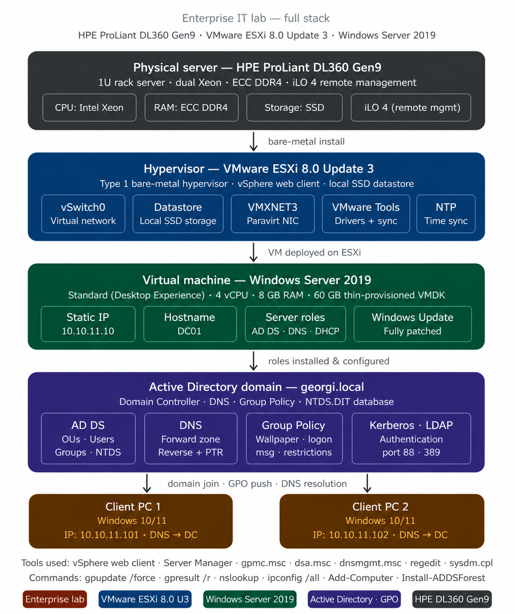
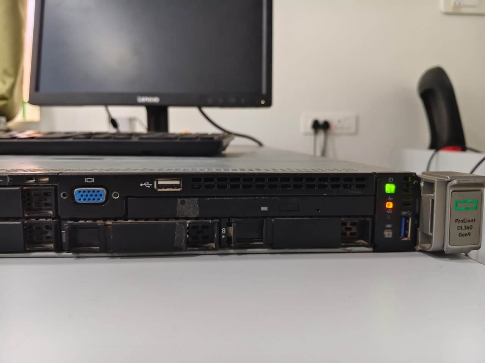
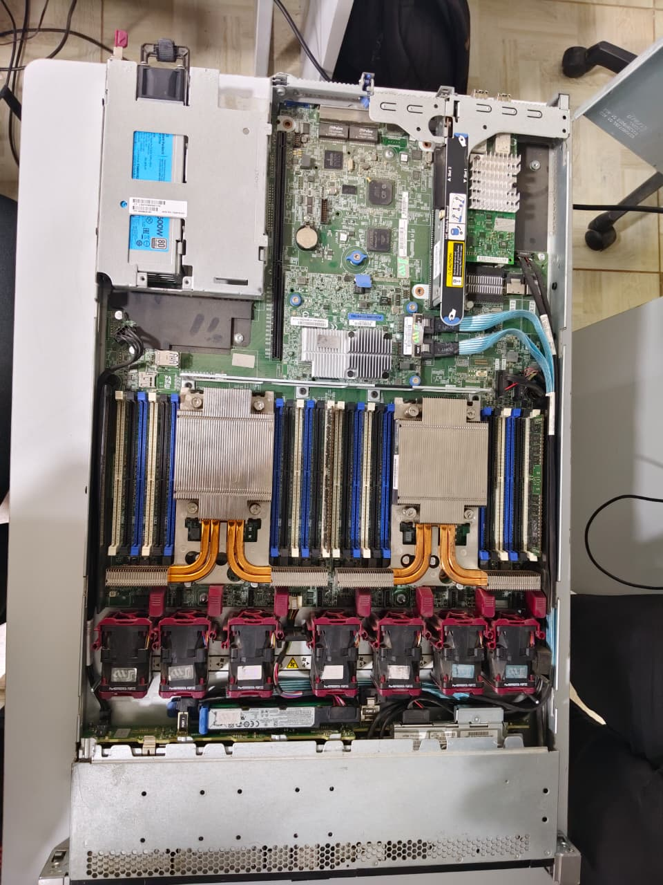
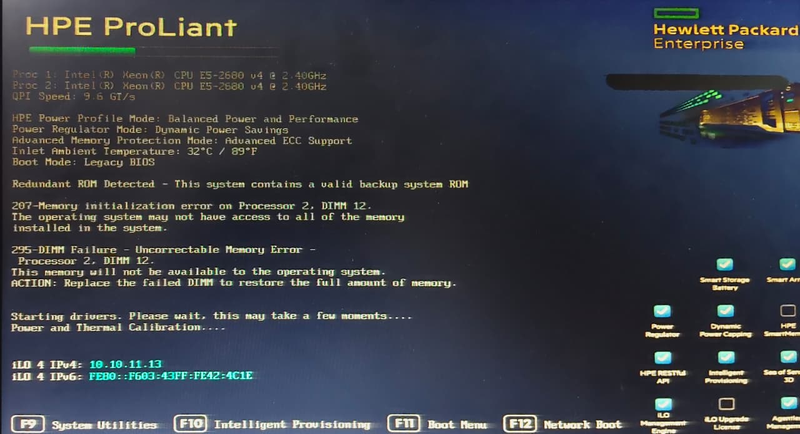
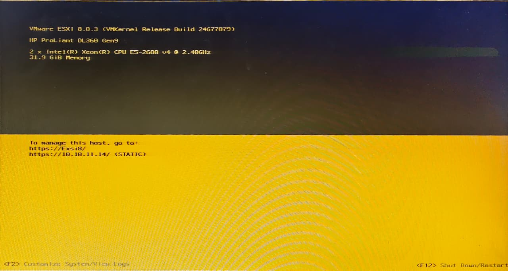
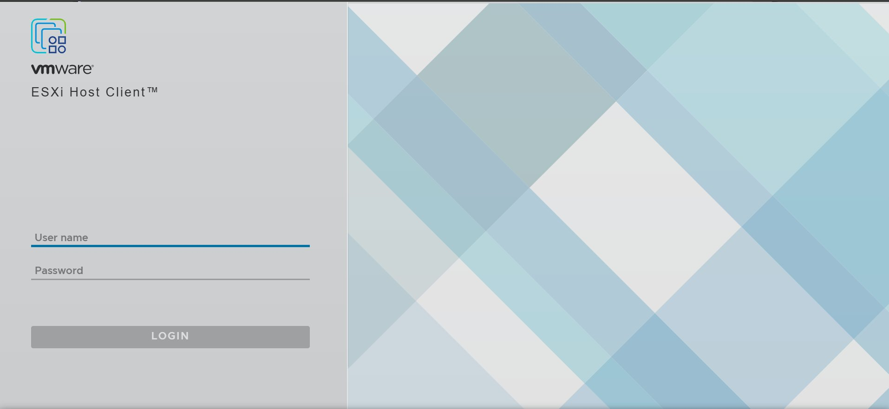

# Lab 01 — VMware ESXi Installation & VM Deployment

**Environment:** VMware ESXi 8.0 Update 3 on HPE ProLiant DL360 Gen9 (physical hardware)
**Vatanix Technologies, Trichy**

---

## Objective

Install VMware ESXi 8.0 bare-metal on a physical enterprise server and deploy a
Windows Server 2019 virtual machine via the vSphere Host Client, establishing the
foundation for the Windows Server lab series.

---

## Lab Stack Overview

> This diagram shows the full intended lab stack from physical hardware up through
> client machines. **This lab (01) covers only the bottom two layers** — the physical
> HPE server and the ESXi/VM deployment layer. Active Directory, DNS, GPO, and
> domain-joined clients shown further up the stack were built separately in a
> different environment — see Labs 02–06.

---

## Physical Hardware

| Component | Details |
|---|---|
| Server Model | HP ProLiant DL360 Gen9 |
| CPU | 2x Intel Xeon E5-2680 v4 @ 2.40GHz |
| Total vCPUs | 28 |
| RAM | ~32 GB |
| Storage | ~2 TB VMFS6 Datastore |
| Management | HPE iLO 4 |

---

## Network Design

| Device | IP Address | Role |
|---|---|---|
| ESXi Host | 10.10.11.14 (Static) | Hypervisor management |
| iLO Interface | 10.10.11.13 | Remote hardware management |

---

## Phase 1 — Physical Server Inspection

> Front panel of the HPE ProLiant DL360 Gen9 — 1U rack server with hot-swap drive
> bays, VGA, USB, and the iLO 4 management module on the right.

> Internal view showing dual Intel Xeon CPUs with heatsinks, DIMM slots across
> both processor banks, and the hot-swap fan array.

---

## Phase 2 — Power-On and POST Diagnostics

> The POST screen confirms dual Xeon E5-2680 v4 CPUs and displays the **iLO 4 IPv4
> address: 10.10.11.13** — used for all subsequent remote management.
>
> **Real issue found during POST:** `295-DIMM Failure - Uncorrectable Memory Error -
> Processor 2, DIMM 12`. The system flagged DIMM 12 on Processor 2 as failed and
> excluded it from available memory automatically. This did not block ESXi
> installation — the server continued boot with the remaining functional DIMMs —
> but it is a genuine hardware fault that would need a DIMM replacement to restore
> full RAM capacity in a production setting.

---

## Phase 3 — ESXi Installation

### Steps Performed

1. Downloaded VMware ESXi 8.0 Update 3 ISO
2. Created bootable USB using Rufus — GPT partition scheme, UEFI mode
3. Booted HPE DL360 Gen9 — pressed F11 for Boot Menu, selected USB
4. Ran ESXi installer — accepted EULA, selected local storage, set root password
5. Configured static management IP: `10.10.11.14`
6. Accessed vSphere Host Client via browser: `https://10.10.11.14`

> Confirms **VMware ESXi 8.0.3 (VMKernel Build 24677879)** running on the HP
> ProLiant DL360 Gen9 with 31.9 GiB memory recognised — consistent with one DIMM
> excluded due to the POST error above. Management URL confirmed as
> `https://10.10.11.14/` (static).

---

## Phase 4 — ESXi Host Client Access

> VMware ESXi Host Client login page, accessed at `https://10.10.11.14`. Logged
> in with the `root` account configured during installation.

> Host dashboard confirms:
> - Version: **8.0 Update 3**
> - Manufacturer: HP, Model: **ProLiant DL360 Gen9**
> - 4 Virtual Machines registered
> - Memory: 29.79 GB free of 31.88 GB capacity
> - Storage: 1.3 TB free of 2.06 TB capacity (37% used)

---

## Phase 5 — Datastore Verification

> Storage tab confirms `datastore1` — **2.06 TB capacity, VMFS6, Non-SSD, Single
> access**, with 773.05 GB provisioned and 1.3 TB free. This is the local storage
> used for all VM disk files in this lab series.

---

## VM Deployment

### VM Configuration — Windows Server 2019

| Setting | Value |
|---|---|
| vCPUs | 4 (2 sockets × 2 cores) |
| RAM | 8 GB |
| Disk | 150 GB thin provisioned VMDK |
| NIC | VMXNET3 (paravirtualised) |
| OS | Windows Server 2019 Standard (Desktop Experience) |

### Key Decisions

**VMXNET3 over E1000** — VMXNET3 is a paravirtualised driver optimised for ESXi.
E1000 emulates a physical Intel NIC and is slower. VMXNET3 requires VMware Tools
to activate fully.

**Thin provisioned disk** — disk file grows as data is written, saving datastore
space. Suitable for lab VMs.

**VMware Tools** — installed immediately after OS install. Activates VMXNET3
driver, enables memory ballooning, fixes time synchronisation, and allows graceful
shutdown from vSphere.

---

## Challenges Faced

| Challenge | Root Cause | Resolution |
|---|---|---|
| DIMM 12 memory error at POST | Uncorrectable memory error on Processor 2, DIMM 12 | Identified via POST diagnostics; system continued with remaining DIMMs (31.9 GiB usable). Noted for future DIMM replacement |
| VM network showing 100 Mbps | E1000 NIC selected, VMware Tools not installed | Changed to VMXNET3, installed VMware Tools |
| Host unreachable after cable plug-in | Ethernet cable plugged into iLO port instead of standard NIC | Identified port mismatch using POST screen IP reference, moved cable to correct NIC port |

---

## Lessons Learned

- POST diagnostics catch real hardware faults before the OS even loads — always read the full POST output, not just the boot logo
- A single failed DIMM does not necessarily stop the system — ESXi installed and ran fine on the remaining functional memory
- iLO and standard NIC ports look identical — the POST screen's iLO IPv4 display is the fastest way to confirm which interface is which
- VMware Tools is mandatory — install immediately after OS deploy; VMXNET3, time sync, and graceful shutdown all depend on it
- Datastore browser and storage tab are the fastest way to verify actual usable capacity vs raw disk size

---

## Screenshots

| Screenshot | Description |
|---|---|
|  | Full lab architecture — this lab covers the physical + ESXi layers only |
|  | HPE DL360 Gen9 front panel |
|  | Internal — dual CPUs, RAM, fans |
|  | POST diagnostics — iLO IP, DIMM 12 memory error |
|  | ESXi 8.0.3 booting on physical server |
|  | ESXi Host Client login page |
|  | Host dashboard — VMs, RAM, storage |
|  | VMFS6 datastore — capacity and usage |
