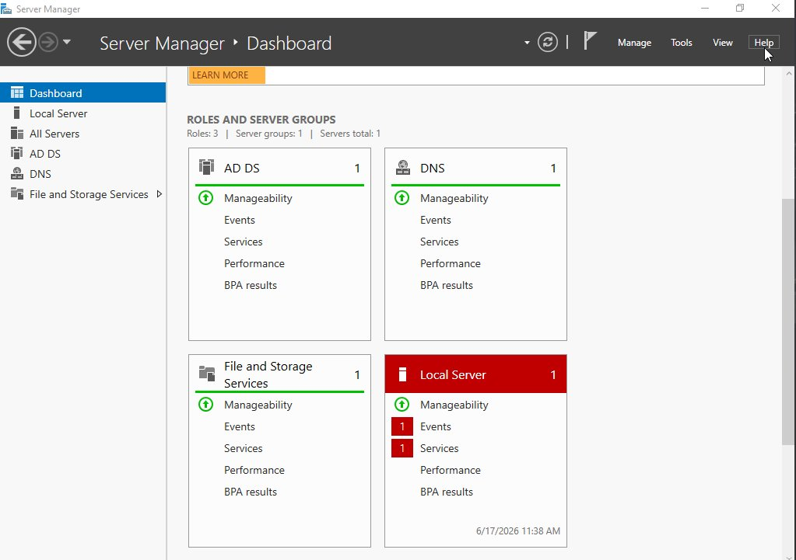
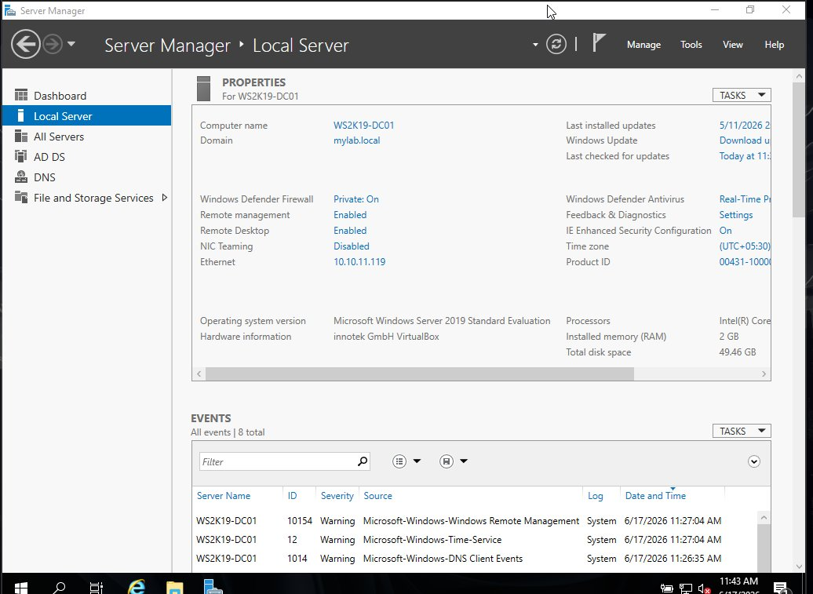
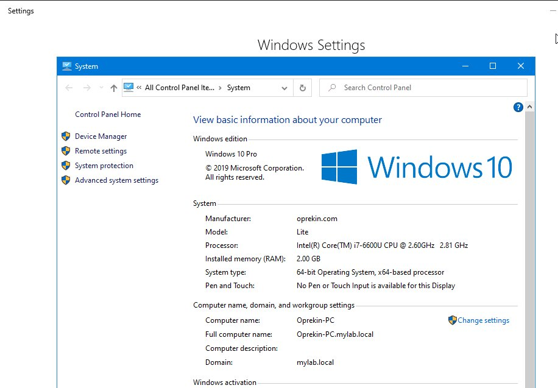

# Lab 02 — Active Directory Domain Services & Domain Controller Promotion

**Topics:** AD DS · Domain Controller · Forest · Domain Promotion · Domain Join

---

## Objective

Install Active Directory Domain Services (AD DS) on Windows Server 2019, promote the
server to a Domain Controller, create a new forest and domain, and join a Windows 10
client machine to the domain.

---

## Environment

| Component | Detail |
|-----------|--------|
| Server OS | Windows Server 2019 Standard Evaluation |
| Server Hostname | WS2K19-DC01 |
| Server IP | 10.10.11.119 (static) |
| Domain | mylab.local |
| Client OS | Windows 10 Pro |
| Client Hostname | Oprekin-PC |

---

## Key Concepts

**Active Directory Domain Services (AD DS)** provides centralised identity and access
management. It stores information about users, computers, and resources in a hierarchical
database and handles all authentication in the domain.

**Domain Controller (DC)** is the server that runs AD DS. All authentication requests
in the domain go through the DC.

**Forest** is the top-level container in AD. The first domain created becomes the
Forest Root Domain.

**FQDN** — the complete domain name used internally, e.g. `mylab.local`. The `.local`
suffix is standard for private domains not accessible on the internet.

---

## Configuration Steps

---

### STEP 1 — Set a Static IP on the Server

Before promoting to DC, assign a static IP. A DC must never use DHCP for its own
address — clients use this IP as their DNS server, so it must never change.

```
IP Address    : 10.10.11.119
Subnet Mask   : 255.255.255.0
Default GW    : 10.10.11.1
DNS Server    : 127.0.0.1
```

> **Why 127.0.0.1 for DNS?** Once AD DS is installed, the DC becomes its own DNS
> server. Pointing itself to 127.0.0.1 means all domain queries resolve locally.

---

### STEP 2 — Install the AD DS Role

```
Server Manager → Manage → Add Roles and Features
→ Role-based installation
→ Select: Active Directory Domain Services
→ Add Features when prompted
→ Install
```

> Installing the role and promoting to DC are two separate steps. This installs the
> binaries only — the server is not yet a DC.

---

### STEP 3 — Promote the Server to Domain Controller

```
Server Manager → Flag notification → Promote this server to a domain controller

Deployment Configuration:
  → Add a new forest
  → Root domain name: mylab.local

Domain Controller Options:
  → DNS Server: ✓
  → Global Catalog: ✓
  → DSRM Password: (set and store securely)

Additional Options:
  → NetBIOS name: MYLAB (auto-filled)

Paths: leave as defaults
  → AD DS Database : C:\Windows\NTDS
  → SYSVOL         : C:\Windows\SYSVOL

→ Review → Install (server restarts automatically)
```

> **Why "Add a new forest"?** We are building a brand new AD environment from scratch.
> This creates the Forest Root Domain.

> **Why DNS checked?** AD DS is tightly coupled with DNS — domain-joined clients
> locate the DC by querying DNS for SRV records that AD registers automatically.
> Without DNS on the DC, domain join and authentication fail.

> **What is DSRM?** Directory Services Restore Mode — a safe-mode boot used to repair
> the AD database. Store this password securely; losing it makes recovery very difficult.

---

### STEP 4 — Verify After Restart

Log in with `MYLAB\Administrator` after reboot.

```cmd
# Verify domain
echo %USERDOMAIN%

# Verify DC and domain info
nslookup mylab.local

# Check SRV records that AD registered in DNS
nslookup -type=SRV _ldap._tcp.mylab.local
```

Expected: `_ldap._tcp.mylab.local` resolves to the DC IP.

> **Why check SRV records?** Client machines use these to find the DC. If missing,
> domain join fails even when the DC itself is working fine.

---

### STEP 5 — Join the Windows 10 Client to the Domain

On the Windows 10 client machine:

```
1. Set DNS to the DC IP:
   Network Adapter → DNS Server: 10.10.11.119

2. System → About → Rename this PC (Advanced)
   → Member of Domain: mylab.local
   → Credentials: MYLAB\Administrator + password

3. Restart when prompted

4. Login screen → Other user → MYLAB\Administrator
```

> **Why set DNS to the DC first?** The client uses DNS to locate the DC before
> attempting the domain join. If DNS still points to the router or ISP, it cannot
> resolve `mylab.local` and the join fails.

---

## Screenshots

### Server Manager Dashboard — Roles Installed



> AD DS, DNS, and File and Storage Services all showing green (Manageable).
> Local Server shows warnings — Event ID 10154 (WinRM config) and Event ID 12
> (time sync on VM) — both are common and do not affect AD DS or DNS operation.

---

### Local Server Properties — DC Configuration



> Hostname WS2K19-DC01 joined to mylab.local. Static IP 10.10.11.119.
> Remote Desktop enabled. Windows Defender Firewall active on Private profile.

---

### Windows 10 Client — Successfully Joined to Domain



> Client machine Oprekin-PC (Intel i7-6600U, 2 GB RAM, Windows 10 Pro) successfully
> joined to mylab.local. Full computer name shows Oprekin-PC.mylab.local confirming
> the domain suffix was applied correctly.

---

## Verification Summary

| Check | Method | Expected |
|-------|--------|----------|
| DC roles installed | Server Manager Dashboard | AD DS, DNS green |
| Domain joined | Client System Properties | Domain: mylab.local |
| Full computer name | Client System Properties | Oprekin-PC.mylab.local |
| LDAP SRV record | `nslookup -type=SRV _ldap._tcp.mylab.local` | DC IP returned |
| DC login format | Login screen | MYLAB\Administrator |

---

## Common Issues & Fixes

| Problem | Cause | Fix |
|---------|-------|-----|
| Domain join fails — domain not found | Client DNS not pointing to DC | Set client DNS to 10.10.11.119 first |
| Cannot log in after DC promotion | Wrong username format | Use `MYLAB\Administrator` not just `Administrator` |
| SRV records missing | AD DNS registration delayed | Run `ipconfig /registerdns` on DC |
| Server Manager shows Local Server red | WinRM / time sync warnings | Common on VMs — check Event IDs, not critical for lab |

---

## Lessons Learned

- Always set a static IP on the DC before installation — DHCP and DC are incompatible
- DNS is a hard dependency for AD, not optional — always install it on the DC
- The DC must point its own DNS to `127.0.0.1` so it resolves domain queries itself
- Set client DNS to the DC IP before attempting domain join — this is the most common mistake
- After domain join, always log in as `DOMAIN\username`, not just `username`
